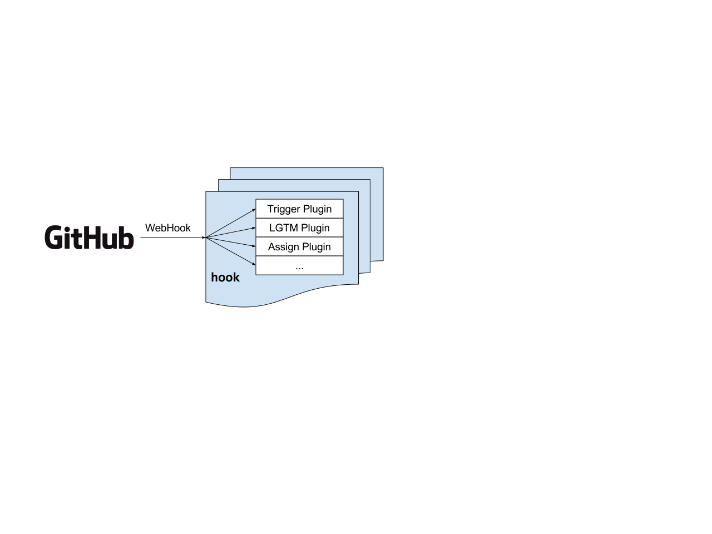

# Prow Architecture

Prow comprises a collection of services that live in a Kubernetes cluster. We architected it to avoid several pitfalls that we encountered while maintaining Jenkins and mungegithub:

* **Deployments must be rolled out with no downtime.** It is not acceptable to force updates to happen outside of working hours, especially when projects are distributed around the world. We found ourselves in this place with Jenkins, where updates took a considerable amount of time and often had to be rolled back due to bugs. With mungegithub updating is less painful, however it still results in confusion for developers who happen to check the page in the few minutes that it is down. Prow uses stateless Kubernetes deployments to solve this problem.
* **Config must be stored in source control.** While it’s possible to store Jenkins results in source control using tools like Jenkins Job Builder, it’s certainly not easy. Prow uses Kubernetes ConfigMaps to store application config. This also makes it possible to update them without redeploying the binaries.
* **Application state is hard, so let others handle that.** We constantly faced issues with Jenkins state becoming corrupted in various ways. Instead, prow lets GitHub and etcd (via Kubernetes) store its state.

### `cmd/hook`



`cmd/hook` is a stateless, replicated server that listens to GitHub webhooks and dispatches them to plugins. Plugins are individual go packages that register to receive hooks at init time.

## Life of a Prow Job

I comment `/test all` on a PR. GitHub creates a JSON object representing that action and sends a webhook to prow. [Here](https://github.com/kubernetes/test-infra/tree/c8829eef589a044126289cb5b4dc8e85db3ea22f/prow/cmd/phony/examples) are some examples of webhook payloads.

The webhook finds its way into the cluster with the help of an [Ingress](https://github.com/kubernetes/test-infra/blob/c8829eef589a044126289cb5b4dc8e85db3ea22f/prow/cluster/ingress.yaml) object. This object has a rule stating that `/hook` goes to the [hook service](https://github.com/kubernetes/test-infra/blob/c8829eef589a044126289cb5b4dc8e85db3ea22f/prow/cluster/hook_service.yaml) which is backed by the [hook deployment](https://github.com/kubernetes/test-infra/blob/c8829eef589a044126289cb5b4dc8e85db3ea22f/prow/cluster/hook_deployment.yaml) and finally into the [hook program](https://github.com/kubernetes/test-infra/tree/c8829eef589a044126289cb5b4dc8e85db3ea22f/prow/cmd/hook) itself. The hook program deserializes the payload into the appropriate go struct, and then passes it along to each plugin.

To each plugin, hook passes two objects: a [plugin client](https://github.com/kubernetes/test-infra/blob/c8829eef589a044126289cb5b4dc8e85db3ea22f/prow/plugins/plugins.go#L64-L70) and the deserialized GitHub event. In this case, the event is an [IssueCommentEvent](https://github.com/kubernetes/test-infra/blob/c8829eef589a044126289cb5b4dc8e85db3ea22f/prow/github/types.go#L116-L121). The plugin client has a Kubernetes client, a GitHub client, and the prow config:

```go
type PluginClient struct {
	GitHubClient *github.Client
	KubeClient   *kube.Client
	Config       *config.Config
	Logger       *logrus.Entry
}
```

The [trigger](https://github.com/kubernetes/test-infra/tree/c8829eef589a044126289cb5b4dc8e85db3ea22f/prow/plugins/trigger) plugin has a function called [`handleIC`](https://github.com/kubernetes/test-infra/blob/c8829eef589a044126289cb5b4dc8e85db3ea22f/prow/plugins/trigger/ic.go#L31) that it [registered at init-time](https://github.com/kubernetes/test-infra/blob/c8829eef589a044126289cb5b4dc8e85db3ea22f/prow/plugins/trigger/trigger.go#L35). This function checks the issue comment for any test requests by comparing the issue comment body to the list of jobs supplied in the `Config` object in the `PluginClient`. I requested that some tests run, so the trigger plugin talks to the Kubernetes API server and creates a [ProwJob ThirdPartyResource](https://github.com/kubernetes/test-infra/blob/c8829eef589a044126289cb5b4dc8e85db3ea22f/prow/kube/prowjob.go#L50-L83) with the information from the issue comment. At this point, `cmd/hook`'s role is done. It goes on and handles the next webhooks.

The ProwJob that it creates looks a little like this, although I elided some of the pod details:

```yaml
apiVersion: prow.k8s.io/v1
kind: ProwJob
metadata:
  name: 32456927-35d9-11e7-8d95-0a580a6c1504
spec:
  agent: kubernetes
  context: Bazel test
  job: pull-test-infra-bazel
  pod_spec:
    containers:
    - image: gcr.io/k8s-testimages/bazelbuild:0.11
  refs:
    base_ref: master
    base_sha: 064678510782db5b382df478bb374aaa32e577ea
    org: kubernetes
    pulls:
    - author: ixdy
      number: 2716
      sha: dc32ccc9ea3672ccc523b7cbaa8b00360b4183cd
    repo: test-infra
  report: true
  rerun_command: '@k8s-bot bazel test this'
  type: presubmit
status:
  startTime: 2017-05-10T23:34:22.567457715Z
  state: triggered
```

Every thirty seconds, `cmd/plank` runs a [`Sync`](https://github.com/kubernetes/test-infra/blob/c8829eef589a044126289cb5b4dc8e85db3ea22f/prow/plank/controller.go#L71) function that lists ProwJobs and Kubernetes pods in the cluster. For each ProwJob, it runs [`syncKubernetesJob`](https://github.com/kubernetes/test-infra/blob/c8829eef589a044126289cb5b4dc8e85db3ea22f/prow/plank/controller.go#L233-L296). This function notices that the above ProwJob does not have a corresponding Kubernetes pod, so it creates one in the [`test-pods`](https://github.com/kubernetes/test-infra/blob/c8829eef589a044126289cb5b4dc8e85db3ea22f/prow/cluster/test_pod_namespace.yaml) namespace using the pod spec in the ProwJob. It also injects environment variables into the container such as `PULL_NUMBER` and `JOB_NAME`. It also updates the status line on the PR with a link to Gubernator, which will provide real-time logs and results.

Several minutes later, the `syncKubernetesJob` method notices that the Kubernetes pod in that ProwJob has finished and succeeded. It sets the ProwJob status to success and sets the status line on GitHub to success. A green check-mark shows up on the PR.

A day later, [`cmd/sinker`](https://github.com/kubernetes/test-infra/blob/c8829eef589a044126289cb5b4dc8e85db3ea22f/prow/cmd/sinker/main.go#L58-L92) notices that the job and pod are a day old and deletes them from the Kubernetes API server.
